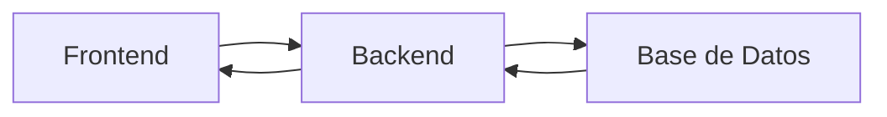
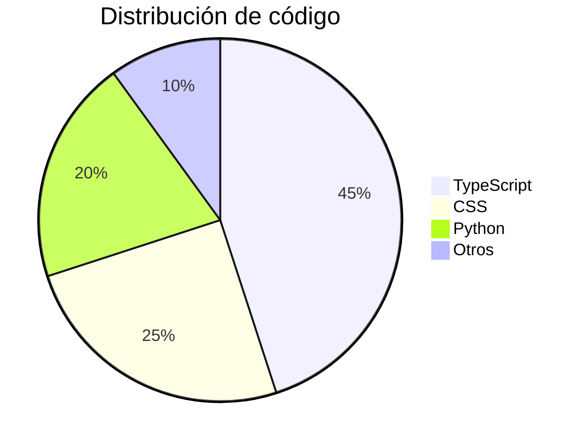
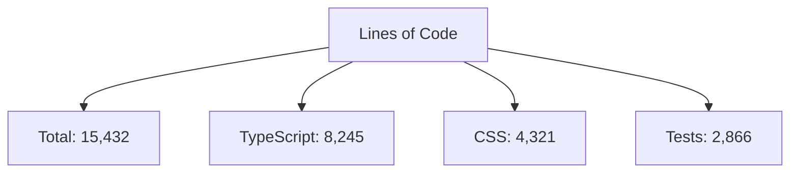

# 🚀 Proyecto Asombroso


Un proyecto increíble que revolucionará la forma en que interactúas con la tecnología.



## ✨ Características Destacadas

- 🔥 **Ultra rápido**: Optimizado para máximo rendimiento
- 🎨 **Interfaz moderna**: Diseño elegante y intuitivo
- 🔒 **Seguridad avanzada**: Protección de datos de nivel enterprise
- 📱 **Responsive**: Funciona en cualquier dispositivo

## 🛠️ Stack Tecnológico

| Capa | Tecnologías |
|------|-------------|
| Frontend | React, TypeScript, TailwindCSS, Vite |
| Backend | Node.js, Express, GraphQL |
| Base de datos | MongoDB, Redis |
| DevOps | Docker, GitHub Actions, AWS |

## 📊 Métricas del Proyecto



## 🚀 Instalación Rápida

```bash
# Clona el repositorio
git clone https://github.com/tu-usuario/tu-proyecto.git

# Entra en el directorio
cd tu-proyecto

# Instala dependencias
npm install

# Configura variables de entorno
cp .env.example .env

# Inicia el proyecto
npm run dev
```

## 🎯 Uso Básico

```javascript
import { Proyecto } from 'tu-proyecto';

// Inicialización
const instancia = new Proyecto({
  modo: 'avanzado',
  plugins: ['stats', 'analytics']
});

// Uso
instancia.ejecutar()
  .then(resultado => {
    console.log('Éxito:', resultado);
  })
  .catch(error => {
    console.error('Error:', error);
  });
```

## 📁 Estructura del Proyecto

```
src/
├── components/          # Componentes React
├── hooks/              # Custom hooks
├── utils/              # Utilidades
├── styles/             # Estilos globales
├── types/              # Definiciones TypeScript
└── assets/             # Recursos estáticos
```

## 🔧 Comandos Disponibles

| Comando | Descripción |
|---------|-------------|
| `npm run dev` | Inicia servidor de desarrollo |
| `npm run build` | Compila para producción |
| `npm run test` | Ejecuta tests |
| `npm run lint` | Análisis de código |
| `npm run deploy` | Despliegue en producción |

## 🤝 Guía de Contribución

1. Haz fork del proyecto
2. Crea una rama: `git checkout -b feature/nueva-funcionalidad`
3. Realiza tus cambios y commitea: `git commit -m 'Añadir funcionalidad'`
4. Push a la rama: `git push origin feature/nueva-funcionalidad`
5. Abre un Pull Request

## 🧪 Suite de Tests

```bash
# Ejecutar tests unitarios
npm test:unit

# Ejecutar tests de integración
npm test:integration

# Ejecutar tests e2e
npm test:e2e

# Generar coverage report
npm run test:coverage
```

## 📈 Estadísticas de Código



## 🐛 Reportar Issues

Si encuentras un error, por favor crea un issue con:

1. Descripción detallada del problema
2. Pasos para reproducirlo
3. Comportamiento esperado vs actual
4. Capturas de pantalla (si aplica)
5. Entorno (SO, navegador, versión)

## 📄 Licencia

Este proyecto está bajo la Licencia MIT. Ver el archivo [LICENSE](LICENSE) para más detalles.

## 🏆 Contributors

<!-- ALL-CONTRIBUTORS-LIST:START - Do not remove or modify this section -->
<!-- prettier-ignore-start -->
<!-- markdownlint-disable -->
| [<br /><sub><b>Nombre 1</b></sub>](https://github.com/user1) | [<br /><sub><b>Nombre 2</b></sub>](https://github.com/user2) | [<br /><sub><b>Nombre 3</b></sub>](https://github.com/user3) |
| :---: | :---: | :---: |
<!-- markdownlint-restore -->
<!-- prettier-ignore-end -->
<!-- ALL-CONTRIBUTORS-LIST:END -->

## ⭐ Historial de Versiones

* **1.0.0**
  * Lanzamiento inicial
  * Funcionalidades base implementadas
* **0.5.0-beta**
  * Primera versión beta
  * Características experimentales

## 🔮 Roadmap

- [ ] Soporte para plugins de terceros
- [ ] Versión mobile nativa
- [ ] Internacionalización (i18n)
- [ ] Modo offline
- [ ] API pública

## 📞 Soporte

Si necesitas ayuda, puedes:

1. Revisar la [documentación completa](https://docs.tu-proyecto.com)
2. Buscar en [issues anteriores](https://github.com/tu-usuario/tu-proyecto/issues)
3. Crear un [nuevo issue](https://github.com/tu-usuario/tu-proyecto/issues/new)
4. Contactarnos en [soporte@tu-proyecto.com](mailto:soporte@tu-proyecto.com)

## 🎨 Personalización

Puedes personalizar el proyecto mediante variables de entorno:

```env
APP_MODO=desarrollo
API_URL=https://api.tu-proyecto.com
ANALYTICS_ID=UA-XXXXX-X
```

---

<div align="center">

**¿Te gusta el proyecto? ¡Dale una estrella! ⭐**

[](https://star-history.com/#tu-usuario/tu-proyecto&Date)

</div>

---

> **Nota**: Este README se genera automáticamente. Para cambios sustanciales, edita el archivo `README_template.md`

<!-- MARKDOWN LINKS -->
[contributors]: https://github.com/tu-usuario/tu-proyecto/graphs/contributors
[license]: https://github.com/tu-usuario/tu-proyecto/blob/main/LICENSE
[issues]: https://github.com/tu-usuario/tu-proyecto/issues
[pull-requests]: https://github.com/tu-usuario/tu-proyecto/pulls
